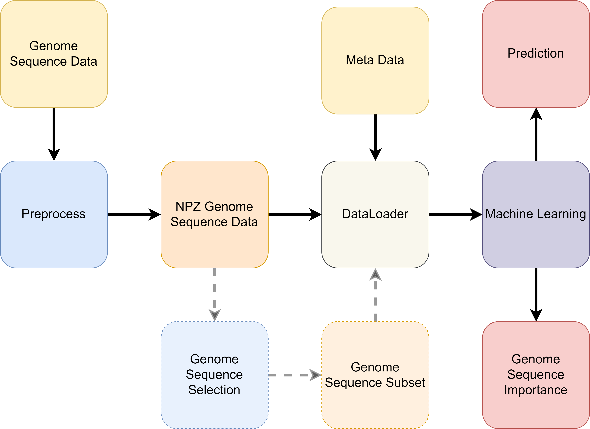

Overview
########

The ``genolearn`` package is a pipeline designed to enable researchers to use off-the-shelf machine learning toolkits on genome sequence data in Python3. Additionally, ``genolearn`` is a loose wrapper around the popular machine learning toolkit ``sklearn`` where the machine learning models are accessible via ``genolearn.models`` (see :ref:`Models <Models>` for more details.).

.. raw:: html

    
    

        <figure>
            
              
            <figurecaption>Figure 1. <i>End to end pipeline of genolearn.</i></figurecaption>
        </figure>
         
    

Our pipeline starts with the raw genome sequence data which assumes a certain data format (see :ref:`Preprocessing <Preprocessing>` for more details). Running the ``genolearn`` package directly on the raw genome sequence data generates a compressed converted data representation using ``numpy`` which results in ``.npz`` files.

With the compressed converted files, there is an optional script to run which performs genome sequence selection which reduces the number of genome sequences to consider when performing later machine learning tasks. By reducing the space of genome sequences to consider, the model complexity, along with computational and memory demands are reduced.

Next, we can use the ``DataLoader`` class to read in the meta data as well as the ``.npz`` files efficiently, optionally only filtering on genome sequences from the previous section, to then give to a off-the-shelf Machine Learning framework. For example, we can train a classifier which maps from some genome sequences input to meta data classification such as using :math:`k`-mer counts to predict strain location discussed in :ref:`Paper A <PaperA>`.
        

Data
====

To use GenoLearn once you have installed it, we require you to first preprocess your genome sequence files (such as an fsm-lite gun-zipped) into a more readable format. This requires executing the package on a ``.gz`` file specifying any options. The ``.gz`` file should be a text file with the following format:

.. code-block:: text

    sequence_1 | identifier_{1,1}:count_{1,1} identifier_{1,1}:count_{2,1} ...
    sequence_2 | identifier_{2,1}:count_{2,1} identifier_{2,1}:count_{2,2} ...
    ...

where identifier\_{i,j} is the j-th identifier that contains the i-th sequence count\_{i,j} many times. If an identifier does not contain the i-th sequence, then both the identifier and the associated zero count are omitted from the i-th row as the data is in sparse format (only containing non-zero information).

Preprocessing
=============

First you will need to preprocess your data into a format this package has been optimized for. Depending on the magnitude of your data and the specifications of your machine, this may take minutes or even hours.

The preprocessing writes to a directory specified by the user. By default, the directory will be

.. code-block:: text
    
    DATASET NAME
    ├── dense
    |   ├── *.npz
    ├── feature-selection
    ├── sparse
    |   ├── *.npz
    ├── features.txt
    ├── log.txt
    └── meta.json

+ `dense` folder (optional) contains dense arrays
+ `sparse` folder  (optional) contains sparse arrays
+ `feature-selection` folder is initially empty but can be populated using the later discussed `feature_selection.py` module
+ `features.txt` contains all the genome sequences seperated by a single empty space
+ `log.txt` contains the parameters used to generate the current folder, the timestamp of the execution, and the RAM usage
+ `meta.json` contains the number of samples :math:`n`, the number of genome sequences :math:`m` and the maximum value observed *max*

The `dense` folder contains dense arrays and the `sparse` folder contains the same information but as sparse arrays. The `feature-selection` folder is initially empty and can be populated using the later discussed `feature_selection` module. The user has the option to produce either the `dense`, `sparse`, or both outputs. The later discussed ``DataLoader`` requires only one data format.

On our **\<NAME OF DATASET WE USE>** dataset, this meant reducing data reading time from hours, in the case of the raw fsm-lite file, to minutes,  in the case of our preprocessed directory.

See :ref:`Preprocessing <Preprocessing>` for more details.

Data Loader
===========

A ``DataLoader`` class can be found in ``genolearn.dataloader``. This expects a path to the previous step's preprocessed directory. The DataLoader class supports returning a dense or sparse matrix for the observations. Later Machine Learning models supports both sparse and dense data which the earlier Preprocessing step can output.

See :ref:`Data Loader <DataLoader>` for more details.

Feature Selection
=================

As the number of genome sequences tends to be large, we need to perform feature selection to then constrain our later Machine Learning models' complexity. This optional step is to remove features with high measures of similarity. 

See :ref:`Feature Selection <FeatureSelection>` for more details.

Models
================

Within ``genolearn.models``, there are machine learning models from the popular library ``sklearn`` and a few useful functions to save / load models.

See :ref:`Models <Models>` for more details.

Feature Importance
==================

After fitting a model, the user may wish to identify which were the most importance features in their dataset. With ``genolearn.feature_importance``, the user can simply call this function on a fitted model and analyse the feature importance based on the particlar model. For example, Logistic Regression will return a set of coefficients for each feature corresponding to the contribution to each class label.

See :ref:`Feature Importance <FeatureImportance>` for more details.

Metrics
=======
